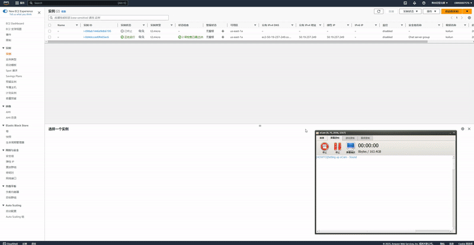

# cloud_rocketchat
В этой работе я использовал облако aws и файл chatserver_cf.yaml в этом репозитории, чтобы создать облачный стек для сервера чата. Затем я использовал ansible, чтобы настроить этот чат-сервер и запустить его.
## Let's chat
Let's Chat is a persistent messaging application that runs on Node.js and MongoDB. It's designed to be easily deployable and fits well with small, intimate teams.

It's free (MIT licensed) and ships with killer features such as LDAP/Kerberos authentication, a REST-like API and XMPP support.

Requirements:
- Node.js 0.11+
- MongoDB 2.6+
- Python 2.7 (shipped with Mac OS X)

Installation
Clone the Let's Chat repository, and install dependencies.
```
git clone https://github.com/sdelements/lets-chat.git
cd lets-chat
npm install
```

Run Let's Chat:
```
npm start
```

Party time at http://localhost:5000/!

## Cloudformation
В моем облаке AWS мой файл cloudformation создает vpc с экземпляром сервера чата, и я использую интернет-шлюз в vpc для привязки общедоступного IP-адреса к серверу в моей подсети vpc. Поскольку новая версия mongodb несовместима с Ubuntu 22.04, я использую образ Ubuntu 20.04. Тип сервера — t2.micro.


Мы установили группу безопасности, чтобы разрешить трафик через порты 22 и 5000, чтобы мы могли подключиться к нашему серверу по ssh и заставить сервер чата работать на порту 5000.


Мы видим, что IP-адрес нашего сервера 50.19.237.249.


## Ansible
Во-первых, мы устанавливаем имя кластера серверов и его IP-адрес в файле hosts, необходимом в ansible. Здесь мы можем сделать это так:
···
[chatserver]
50.19.237.249
···

Затем для настройки сервера нам нужно скачать mongodb, npm, node.js и нужные пакеты. Соответствующие им коды шагов находятся в config.yml.
```
---
- name: Install mongodb
  hosts: chatserver
  remote_user: ubuntu
  become: true
  become_user: root
  tasks:
    - name: Install aptitude using apt
      apt: 
        name: aptitude 
        state: latest 
        update_cache: yes 
    
    - name: Import public key
      apt_key:
        url: 'https://www.mongodb.org/static/pgp/server-4.4.asc'
        state: present
    
    - name: Add repository
      apt_repository:
        filename: '/etc/apt/sources.list.d/mongodb-org-4.4.list'
        repo: 'deb https://repo.mongodb.org/apt/ubuntu bionic/mongodb-org/4.4 multiverse'
        state: present
        update_cache: yes
    
    - name: Install mongoDB
      apt: 
        name: mongodb-org
        state: present
        update_cache: yes
- name: Install node.js and npm
  hosts: chatserver
  remote_user: ubuntu
  become: true
  become_user: root
  tasks:
    - name: Install nodejs
      apt:
        update_cache: yes
        name: nodejs
        state: present
    - name: Install npm
      apt:
        update_cache: yes
        name: npm
        state: present
- name: Configure server
  hosts: chatserver
  remote_user: ubuntu
  become: true
  become_user: root
  tasks:
  - name: Clone let's chat github
    git:
      repo: https://github.com/sdelements/lets-chat.git
      dest: /home/ubuntu/lets-chat/
      clone: yes
      update: yes
  - name: Install npm packages
    ansible.builtin.command:
      chdir: /home/ubuntu/lets-chat/
      cmd: npm install
```

Затем мы запускаем этот плейбук и получаем следующие результаты:


Мы увидели в нем ошибку, которая является напоминанием о том, что используемый серверный код содержит большое количество уязвимостей. Причина в том, что сервер использует очень старую версию mongodb и Node.js, поэтому многие из этих функций устарели. Но это не влияет на развертывание нашего сервера, все окружения теперь фактически развернуты, и мы можем запускать наш сервер.

Через файл run_server.yml запускаем наш сервер.
```
---
- name: Run server
  hosts: chatserver
  remote_user: ubuntu
  become: true
  become_user: root
  tasks:
    - name: Run mongodb
      ansible.builtin.service:
        name: mongod
        state: restarted
    - name: Run server
      ansible.builtin.command:
        chdir: /home/ubuntu/lets-chat/
        cmd: npm start
```

Как показано на рисунке ниже, наш сервер запущен, и мы можем открыть порт 5000 сервера для входа в окно чата.


Использование сервера чата:

